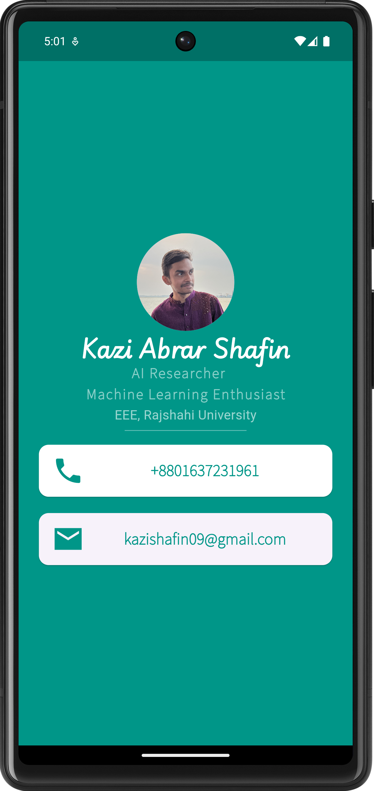

# mi_card

A Flutter app that serves as a personal business card, featuring a clean and interactive UI.

## Screenshot



## Profile

Hello! I'm [Kazi Abrar Shafin], a passionate app developer with experience in building cross-platform applications using Flutter. The "mi_card" project is designed to showcase my skills in UI design and development.

## Contact

- **Email**: [kazishafin09@gmail.com](mailto:kazishafin09@gmail.com)
- **Phone**: [+8801637231961](tel:+8801637231961)

## Getting Started

To run this project locally, follow these steps:

1. Clone the repository:
    ```bash
    git clone https://github.com/AbrarShafin/mi_card.git
    ```
2. Navigate to the project directory:
    ```bash
    cd mi_card
    ```
3. Install dependencies:
    ```bash
    flutter pub get
    ```
4. Run the app:
    ```bash
    flutter run
    ```

## Contributing

Contributions are welcome! Feel free to open an issue or submit a pull request.

## License

This project is licensed under the MIT License - see the [LICENSE](LICENSE) file for details.

